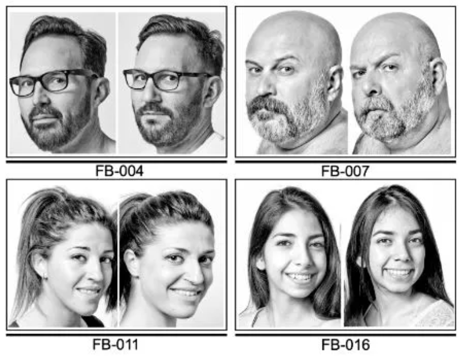

<!-- omit in toc -->
# Similar Face Generation

<!-- omit in toc -->
## Mục lục

- [1. Giới thiệu](#1-giới-thiệu)
- [2. Tổng quan về Similar Face Generation](#2-tổng-quan-về-similar-face-generation)
  - [2.1. Similar Face là gì ?](#21-similar-face-là-gì-)
  - [2.2. Làm sao để phân biệt các khuôn mặt tương tự bằng mắt thường ?](#22-làm-sao-để-phân-biệt-các-khuôn-mặt-tương-tự-bằng-mắt-thường-)
    - [A. Đặc điểm vật lý nhỏ](#a-đặc-điểm-vật-lý-nhỏ)
    - [B. Hành vi và tính cách](#b-hành-vi-và-tính-cách)
  - [2.3. Similar Face Generation là gì ?](#23-similar-face-generation-là-gì-)
    - [A. Face Editing / Face Attribute Manipulation](#a-face-editing--face-attribute-manipulation)
    - [B. Synthetic Face Recognition](#b-synthetic-face-recognition)
- [3. Phương hướng nghiên cứu Similar Face Generation](#3-phương-hướng-nghiên-cứu-similar-face-generation)
  - [3.1. Góc nhìn](#31-góc-nhìn)
  - [3.2. Lộ trình nghiên cứu](#32-lộ-trình-nghiên-cứu)
    - [A. Làm rõ bài toán - Done](#a-làm-rõ-bài-toán---done)
    - [B.](#b)

## 1. Giới thiệu

Trong bối cảnh hệ thống nhận diện khuôn mặt gặp khó khăn trong việc phân biệt cặp song sinh hay các khuôn mặt giống nhau do tổng thể những khuôn mặt rất tương đồng nhau về vẻ bề ngoài. Một nhóm kỹ thuật nhỏ nổi lên để phân biệt những khuôn mặt trông rất giống nhau này như Identical Twins Verification, Face Morphing Attack Detection, Deepfake detection,...

Tuy nhiên, trên thực tế ở nhóm kỹ thuật Identical Twins Verification đang gặp vấn đề liên quan đến dữ liệu, rất khó để tiếp cận dữ liệu khuôn mặt trong thời điểm nhạy cảm hiện nay và đặc biệt là dữ liệu người sinh đôi, người lạ có khuôn mặt giống nhau. Từ đó nảy sinh lên một nhu cầu đó là tạo ra thêm dữ liệu cho tác vụ Identical Twins Verification gọi chung là Similar Face Generation.

Báo cáo này sẽ trình bày thực trạng nghiên cứu Similar Face Generation, định nghĩa, thực trạng, các bài toán lân cận và phương hướng nghiên cứu chính hiện tại.

## 2. Tổng quan về Similar Face Generation

### 2.1. Similar Face là gì ?

  

Similar Face thường đề cập đến hiện tượng khuôn mặt giống nhau, trong đó hai cá nhân hoặc khuôn mặt có những điểm tương đồng nổi bật. Điều này có thể là kết quả của các yếu tố di truyền, chẳng hạn như cặp song sinh hoặc anh em họ giống hệt nhau, hoặc đơn giản là sự trùng khớp ngẫu nhiên về các đặc điểm trên khuôn mặt.

**Look-alikes:**

- Thuật ngữ "*Look-alikes*" hoặc "*Doppelgänger*" thường được dùng để mô tả những cá nhân có ngoại hình giống nhau đến kinh ngạc.

**Genetic Factors:**

- Những cặp song sinh giống hệt nhau có cùng DNA hoặc họ hàng sẽ có những đặc điểm khuôn mặt giống nhau một cách tự nhiên.

⇒ Phát hiện và nhận dạng khuôn mặt tương đồng là một nhiệm vụ đầy thách thức trong lĩnh vực thị giác máy tính và nhận dạng khuôn mặt do nhưng khuôn mặt này có độ tương đồng cao.

### 2.2. Làm sao để phân biệt các khuôn mặt tương tự bằng mắt thường ?

Phân biệt các khuôn mặt giống hệt nhau bằng mắt thường là một nhiệm vụ thách thức, vì họ có ngoại hình rất tương đồng. Tuy nhiên, nhờ vào các khác biệt nhỏ về **vật lý**, **hành vi**, và cách ăn mặc, việc phân biệt họ là hoàn toàn khả thi, đặc biệt khi quan sát kỹ lưỡng.

#### A. Đặc điểm vật lý nhỏ

Các khác biệt vật lý, dù nhỏ, là một trong những cách phổ biến nhất để phân biệt những khuôn mặt giống hệt nhau. Dưới đây là các yếu tố thường được sử dụng:

- **Nốt ruồi, sẹo, hoặc vết bớt:** Theo [Twiniversity - How To Easily Tell Your Identical Twins Apart](https://www.twiniversity.com/how-to-easily-tell-your-identical-twins-apart/), nhiều phụ huynh dựa vào các dấu hiệu như nốt ruồi trên mặt hoặc sẹo từ chấn thương. Ví dụ, một người có thể có một vết sẹo trên trán giống như Harry Potter, trong khi người kia không có.
- **Hình dáng khuôn mặt:** Mặc dù giống nhau, có thể có sự khác biệt nhỏ trong hình dáng tai, mũi, hoặc cấu trúc xương hàm. [Twinfo - Telling Newborn Identical Twins or Triplets Apart](https://www.twinfo.com.au/telling-newborn-identical-twins-apart/) cho biết một trong hai có thể có khuôn mặt tròn hơn, trong khi người kia có khuôn mặt thon hơn.

Bảng dưới đây tóm tắt các đặc điểm vật lý thường được sử dụng:

| **Đặc điểm**          | **Mô tả**                                      | **Ví dụ**                              |
|-----------------------|-----------------------------------------------|----------------------------------------|
| Nốt ruồi, sẹo, vết bớt | Các dấu hiệu độc đáo trên da                  | Vết sẹo trên trán, nốt ruồi trên môi   |
| Hình dáng khuôn mặt   | Sự khác biệt nhỏ ở tai, mũi, hoặc xương hàm   | Tai một bên nhọn hơn, mũi hơi khác     |

#### B. Hành vi và tính cách

Khi song sinh lớn lên, sự khác biệt về hành vi và tính cách trở nên rõ ràng hơn, giúp mọi người phân biệt họ. Theo [wikiHow](https://www.wikihow.life/Tell-a-Set-of-Identical-Twins-Apart/), các yếu tố bao gồm:

- **Biểu cảm**: Theo thời gian và lối sống, mỗi người có thể có một sắc thái biểu cảm (cười, khóc, mếu,...) khác nhau.
- **Tính cách:** Một người có thể năng động hơn, trong khi người kia trầm tĩnh hơn. Ví dụ, một bé có thể thích chơi thể thao, trong khi bé kia thích đọc sách.
- **Cách nói chuyện:** Giọng nói, tốc độ nói, hoặc cách phát âm có thể khác nhau, giúp nhận diện khi giao tiếp.
- **Thói quen:** Một người có thể có thói quen cắn móng tay, trong khi người kia không, theo [Reddit - r/Twins](https://www.reddit.com/r/Twins/comments/11rxnz5/how_do_parents_actually_tell_their_twins-apart/).

### 2.3. Similar Face Generation là gì ?

Similar Face Generation là kỹ thuật tạo ảnh khuôn mặt có độ tương đồng cao với ảnh khuôn mặt đầu vào những vẫn tồn tại những điểm khác biệt nhỏ và tinh tế như nốt ruồi, sẹo, vết bớt, hình dáng khuôn mặt và biểu cảm. Với khái niệm đó, nó có thể rất gần với hai công nghệ sau:

#### A. Face Editing / Face Attribute Manipulation

  

Face Editing / Face Attribute Manipulation là kỹ thuật sử dụng trí tuệ nhân tạo (AI) để **thay đổi hoặc điều chỉnh có chọn lọc các đặc điểm (thuộc tính)** trên khuôn mặt trong một bức ảnh hoặc video mà vẫn giữ được nhận dạng tổng thể của người đó.

Thay vì phải chỉnh sửa thủ công từng pixel, công nghệ này cho phép ta "biến đổi" các thuộc tính của khuôn mặt như tuổi tác, giới tính, kiểu tóc, màu mắt, cảm xúc, thêm/bớt râu, kính, hoặc thậm chí là các chi tiết nhỏ như nốt ruồi, sẹo một cách tự động và chân thực. Các mô hình AI sẽ phân tích khuôn mặt, xác định các thuộc tính, và sau đó tái tạo lại khuôn mặt với các thay đổi mong muốn.

**Một số công trình đáng chú ý:**

* **StyleGAN (StyleGAN2, StyleGAN3):** Nền tảng cho nhiều phương pháp chỉnh sửa khuôn mặt.
* **InterFaceGAN, StyleFlow, GANSpace:** Các phương pháp tìm kiếm hướng trong không gian ẩn của StyleGAN để chỉnh sửa thuộc tính.
* **pSp, e4e, E4S, ReStyle:** Các phương pháp GAN Inversion để đưa ảnh thật vào không gian latent của StyleGAN.
* **Pivotal Tuning Inversion (PTI):** Một kỹ thuật inversion và fine-tuning để chỉnh sửa khuôn mặt cụ thể.
* **ControlNet:** Một kiến trúc cho phép kiểm soát mạnh mẽ các mô hình Diffusion bằng nhiều loại đầu vào khác nhau (ví dụ: Canny edges, depth maps, facial keypoints).
* **IP-Adapter:** Giúp các mô hình Diffusion duy trì identity của một người trong quá trình sinh ảnh.
* **Arc2Face:** Tạo khuôn mặt từ embedding nhận dạng, rất hữu ích cho Similar Face Generation.

#### B. Synthetic Face Recognition

  

Synthetic Face Recognition (Nhận diện khuôn mặt với dữ liệu tổng hợp) là lĩnh vực nghiên cứu và phát triển các hệ thống nhận diện khuôn mặt mà trong đó **dữ liệu huấn luyện chủ yếu hoặc hoàn toàn được tạo ra nhân tạo (tổng hợp)** bằng các mô hình AI (như GANs, Diffusion Models), thay vì dựa vào các bộ dữ liệu ảnh thật được thu thập từ con người.

Mục tiêu chính là khắc phục các thách thức của dữ liệu thật như:
* **Thiếu dữ liệu:** Đặc biệt cho các trường hợp hiếm (ví dụ: song sinh, người bị bệnh hiếm, người lớn tuổi có ít ảnh).
* **Vấn đề riêng tư và đạo đức:** Tránh việc thu thập và sử dụng dữ liệu khuôn mặt thật của con người mà không có sự đồng ý.
* **Thiên vị (Bias):** Dữ liệu thật thường có thiên vị về chủng tộc, giới tính, tuổi tác; dữ liệu tổng hợp có thể được tạo ra để cân bằng hơn.
* **Kiểm soát biến thể:** Dễ dàng tạo ra các biến thể về góc độ, ánh sáng, biểu cảm, độ che khuất (occlusion) cho cùng một người, giúp mô hình mạnh mẽ hơn.

Các nghiên cứu SOTA trong lĩnh vực này tập trung vào việc tạo ra dữ liệu tổng hợp vừa đủ chân thực, vừa có độ đa dạng về nhận dạng (inter-class variation) và đa dạng trong cùng một nhận dạng (intra-class variation), để mô hình nhận diện được huấn luyện có thể hoạt động tốt trên dữ liệu thật.

1.  **[SynFace (2021):](https://arxiv.org/abs/2108.07960)**
    * **Ý tưởng chính:** Khám phá khoảng cách hiệu suất giữa các mô hình nhận diện khuôn mặt SOTA được huấn luyện bằng dữ liệu tổng hợp và dữ liệu thật. Sau đó, đề xuất một mô hình tổng hợp khuôn mặt có thể kiểm soát được để tạo ra lượng lớn ảnh khuôn mặt của các nhận dạng không tồn tại mà không lo ngại vấn đề riêng tư.

2.  **[HyperFace (2023):](https://arxiv.org/abs/2411.08470)**
    * **Ý tưởng chính:** Đề xuất một cách tiếp cận mới để tạo ra các bộ dữ liệu khuôn mặt tổng hợp bằng cách tối ưu hóa các embedding nhận dạng trên một hình cầu siêu phẳng (hypersphere) trong không gian embedding của mô hình nhận diện khuôn mặt. Sau đó, sử dụng một mô hình sinh để chuyển đổi các embedding này thành hình ảnh.

3.  **[SynthDistill (2023):](https://ieeexplore.ieee.org/stamp/stamp.jsp?tp=&arnumber=10766575)**
    * **Ý tưởng chính:** Đề xuất một framework mới để huấn luyện các mô hình nhận diện khuôn mặt nhẹ (lightweight) bằng cách chưng cất tri thức từ một mô hình "giáo viên" (teacher model) đã được huấn luyện trước, sử dụng dữ liệu tổng hợp không có nhãn nhận dạng. Kỹ thuật này giúp tạo ra các biến thể mới của các hình ảnh khó và khám phá không gian ẩn của bộ sinh.

4.  **[DCFace (2024):](https://arxiv.org/abs/2304.07060)**
    * **Ý tưởng chính:** Một framework hoàn toàn dựa trên Diffusion Models, bao gồm hai giai đoạn: (i) giai đoạn lấy mẫu để tạo ra các nhận dạng tổng hợp (XID), và (ii) giai đoạn trộn để tạo ra các hình ảnh (XID,sty) có cùng nhận dạng XID từ giai đoạn lấy mẫu nhưng với các "style" (tư thế, biểu cảm, ánh sáng) được chọn từ một "ngân hàng style" của các hình ảnh.

5.  **[GANDiffFace (2024):](https://arxiv.org/abs/2305.19962)**
    * **Ý tưởng chính:** Một framework kết hợp giữa GANs và Diffusion Models để tạo ra các bộ dữ liệu nhận diện khuôn mặt hoàn toàn tổng hợp. Nó tập trung vào việc cung cấp tính chân thực của khuôn mặt người, phân phối nhân khẩu học có thể kiểm soát và các biến thể trong lớp thực tế.

6. **[UIFace (2025):](https://arxiv.org/abs/2502.19803)**
    * **Ý tưởng chính:** Một framework sử dụng một mô hình khuếch tán (diffusion model) có khả năng sinh ảnh dựa trên cả ngữ cảnh nhận dạng (identity contexts) và một ngữ cảnh rỗng (empty context) có thể học được. Bằng cách "giải phóng" khả năng tiềm ẩn của mô hình diffusion, UIFace tạo ra các biến thể phong phú hơn của cùng một nhận dạng, giúp giải quyết vấn đề thiếu đa dạng trong cùng một nhận dạng (intra-class diversity) của dữ liệu.

## 3. Phương hướng nghiên cứu Similar Face Generation

### 3.1. Góc nhìn

Dựa vào khái niệm và nhu cầu của Similar Face Generation ta có thể tiếp cận nó theo 2 góc nhìn:

- **Face Editing / Face Attribute Manipulation**: Bản chất đây là một bài toàn Face Editing vì ta mong muốn sinh ảnh có độ tương đồng cao với ảnh đầu vào và chỉ tồn tại những khác biệt vô cùng nhỏ.
- **Synthetic Face Recognition**: Tuy nhiên, quay về bài toán gốc đó là trong hệ thống Face Recognition, mô hình chưa được nhìn thấy những mẫu có khuôn mặt giống nhau nhưng thuộc các ID khác nhau nên không trích xuất được các đặc trưng nhỏ nhưng mang tính cá nhân hóa cao. Thì mục đích cốt lõi của Synthetic Face Recognition và Similar Face Generation sẽ giống nhau.

### 3.2. Lộ trình nghiên cứu

#### A. Làm rõ bài toán - Done

#### B. 